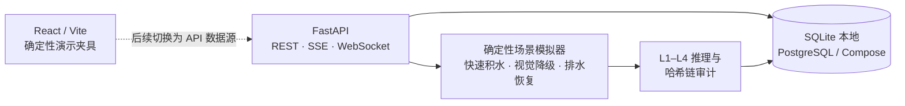
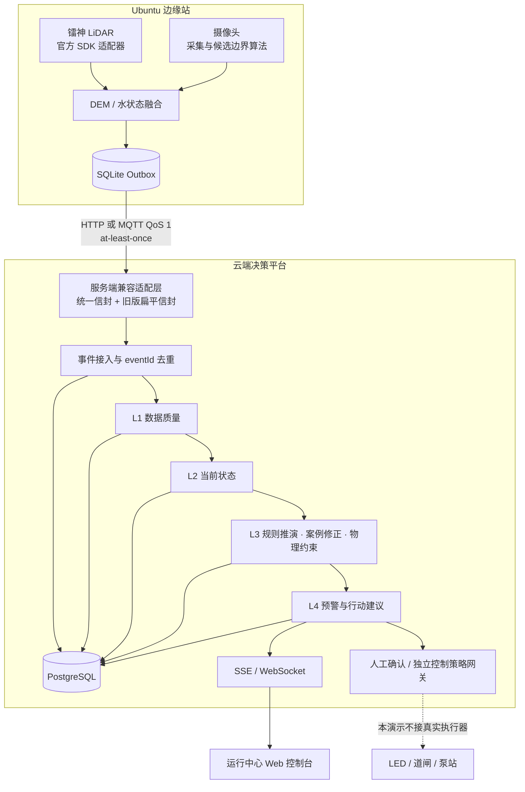

# 预鉴平台架构

## 1. 架构目标

平台围绕三个约束设计：

1. 边缘设备在断网时仍能保留观测，恢复后可幂等补传。
2. 预报结果可回放输入、版本、中间步骤、物理校验和人工处置。
3. 算法风险状态与物理控制状态分离，演示系统不直接控制真实道闸。

## 2. 当前演示拓扑



前端为了挑战杯现场稳定性，目前主要读取 `src/data/demoData.js`，交互状态在浏览器内变化，刷新即可复位。FastAPI 后端是真实可运行服务，提供数据库、推理记录、审计、场景模拟和实时流；当前视觉原型并未把所有页面绑定到这些接口。

## 3. 目标云边架构



## 4. 运行模式

| 模式 | 前端 | 后端 | 数据库 | 用途 |
|---|---|---|---|---|
| Windows 一键本地 | 本机 Vite | 本机 FastAPI | SQLite | 路演、开发、无 Docker 环境 |
| Docker Compose | Node 22 容器 | Python 3.12 容器 | PostgreSQL 16 | 集成演示和数据库验证 |
| Ubuntu 边缘 mock | Python 3.10+ | 独立进程 | SQLite outbox | 硬件协议与断网补传验证 |

本地脚本进程信息保存在 `.demo/processes.json`。停止脚本同时校验 PID 和进程启动时间，避免 PID 重用后误杀其他程序。

## 5. 数据与审计链路

一次完整预报应由同一 `traceId` 串联：

```text
观测事件
  → 数据质量与缺失标记
  → 当前水深/面积/体积/斜率
  → 15/30/60 分钟预测
  → 案例修正依据
  → 水量守恒等物理校验
  → 告警候选
  → 人工确认/驳回
  → 终端回执（生产阶段）
```

后端保存规则、模型、DEM 和标定版本以及各推理步骤。演示哈希链可验证记录是否缺失或被修改，但不应直接等同于司法证据；可信时间戳、电子签名、WORM 和法务确认属于生产建设范围。

## 6. 边缘协议兼容现状

后端接入端点已兼容两套明确版本：

| 位置 | 当前结构 |
|---|---|
| `edge/yujian_edge` | 嵌套信封 `yujian.edge.event/v1`；`source`、`subject`、`quality`、`context`、`payload` |
| server /api/v1/edge/v1/telemetry | 原生接收 EdgeUnifiedEnvelope，同时保留早期扁平 EdgeTelemetryEnvelope |

服务端现有显式适配/归一化层负责校验 schema、解析 identity、把 water.state.v1 转为内部水状态领域事件，并分别处理心跳、边界、DEM 元数据和命令回执。转换过程保留原 eventId、traceId、occurredAt 以及质量、标定和 DEM 版本语义；旧版扁平结构继续作为兼容入口。该适配层不应移除，后续协议升级仍应在这里做版本路由，并用 edge 示例 payload 做契约回归测试。

结构兼容不代表任意演示身份都能入库：直连时 edge 的 tenantId、siteId 和 stationId 必须对应服务端已注册记录，HTTP endpoint 应配置为 /api/v1/edge/v1/telemetry。edge/config.http.example.json 保留为 8080 mock receiver 联调样例。

## 7. 自动联动安全边界

- 预测和建议可以自动生成，物理动作不能由算法服务直接调用。
- 数据降级、DEM 过期、时钟异常、命令过期或设备离线时阻断新动作。
- 执行命令需签名、幂等键、短 TTL、目标白名单和完整回执。
- 关闸前还需现场车辆检测、声光预告和本地安全控制器。
- 风险解除不等于自动抬闸；需稳定窗口和人工确认。
- 当前 `edge` 命令白名单只有采集、心跳和补传，执行器命令刻意禁用。

## 8. 可扩展方向

- 将静态前端数据仓库替换为 API client + SSE 状态仓库。
- 将现有统一信封兼容适配层扩展为可配置版本路由，并持续用 edge 示例 payload 覆盖新旧契约回归。
- 后端实时 broker 从单进程内存实现迁移到 Redis、NATS 或 Kafka。
- 对 DEM/证据帧使用对象存储，数据库仅保存引用和内容哈希。
- 增加 RBAC、多租户、可信时间戳、配置审批与可观测性。
- 使用真实独立水尺/水位计对雨滴反光候选模型进行事件级验证。
